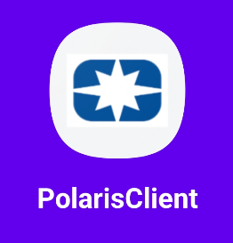

# Polaris - Network Monitoring Client

<p align="center">
  
</p>

<p align="center">
  <strong>A comprehensive Android application for crowdsourcing and mapping mobile network quality and performance data.</strong>
</p>

---

## About The Project

Polaris is an advanced mobile client designed to measure, collect, and visualize network performance data. By running a series of automated and manual tests, the application gathers crucial information about network coverage, speed, and reliability. This data is then presented on an interactive map, providing users and researchers with valuable insights into the quality of service (QoS) of various network operators.

The application is built to run seamlessly in the background to collect data periodically without user intervention, making it a powerful tool for large-scale network analysis.

### Key Features

* **📊 Comprehensive Network Testing:**
    * **Speed Test:** Measures download and upload speeds.
    * **Ping Test:** Calculates latency to various servers.
    * **DNS Test:** Evaluates the response time of DNS servers.
    * **HTTP Test:** Measures the performance of loading web content.
    * **SMS Test:** (Optional) Assesses the reliability and speed of SMS delivery.
* **🛰️ Location & Cellular Data:** Collects location data and cellular network information (like signal strength and network type) to correlate with test results.
* **🗺️ Interactive Map:** Visualizes the collected data points on a map, allowing users to explore network performance in different areas.
* **⚙️ Background Service:** Runs tests automatically at configured intervals to continuously gather data.
* **👤 User Authentication:** Secure sign-up and login system to manage user data.
* **📈 Local Test History:** Users can view the results of all tests performed on their device.

---

## Getting Started

To get a local copy up and running, follow these simple steps.

### Prerequisites

* Android Studio (latest version recommended)
* An Android device or emulator running API level 29 or higher.

### Installation

1.  **Clone the repository:**
    ```sh
    git clone https://github.com/Polaris-IUST/polaris-client.git
    ```
2.  **Open in Android Studio:**
    * Open Android Studio.
    * Click on `File` > `Open` and navigate to the cloned repository directory.
3.  **Add Google Maps API Key:**
    * Obtain a Google Maps API key from the [Google Cloud Console](https://console.cloud.google.com/google/maps-apis/overview).
    * In Android Studio, navigate to `app/src/main/res/values/`.
    * Create a new file named `google_maps_api.xml`.
    * Add the following content to the file, replacing `YOUR_API_KEY` with your actual key:
      ```xml
      <?xml version="1.0" encoding="utf-8"?>
      <resources>
          <string name="google_maps_key" templateMergeStrategy="preserve" translatable="false">YOUR_API_KEY</string>
      </resources>
      ```
4.  **Build and Run:**
    * Let Gradle sync the project dependencies.
    * Click the `Run` button to build and install the application on your selected device or emulator.

---

## Usage

Once the application is installed, you can start using it to measure network performance.

1.  **Sign Up/Login:** Create a new account or log in with existing credentials.
2.  **Grant Permissions:** The app will request necessary permissions for location access, phone state, and sending SMS (if applicable). These are required for the tests to run correctly.
3.  **Run Tests:**
    * From the main dashboard, you can manually trigger different network tests.
    * Enable the **Background Service** from the settings to allow the app to collect data automatically.
4.  **View Results:**
    * Test results are displayed in the "History" or "Dashboard" section.
    * Go to the "Map" section to see a geographical visualization of the data collected by you and other users.

For a complete guide on all features and how to use them, please refer to our official **[User Manual](./USER_MANUAL.pdf)**.

---

## Our Team

This project is made possible by a dedicated team of developers and researchers.

| Name | Role |
| :---: | :---: |
| *[Ali Samadifard]* | *[Android Developer and Backend Developer]* |
| *[Niusha Yaghini]* | *[Frontend Developer]* |
| *[Mahdi Oshani]* | *[Android Developer and Backend Developer]* |

*(Please replace the placeholder text and add images for each team member.)*

---

## License

Distributed under the MIT License. See `LICENSE` for more information.
